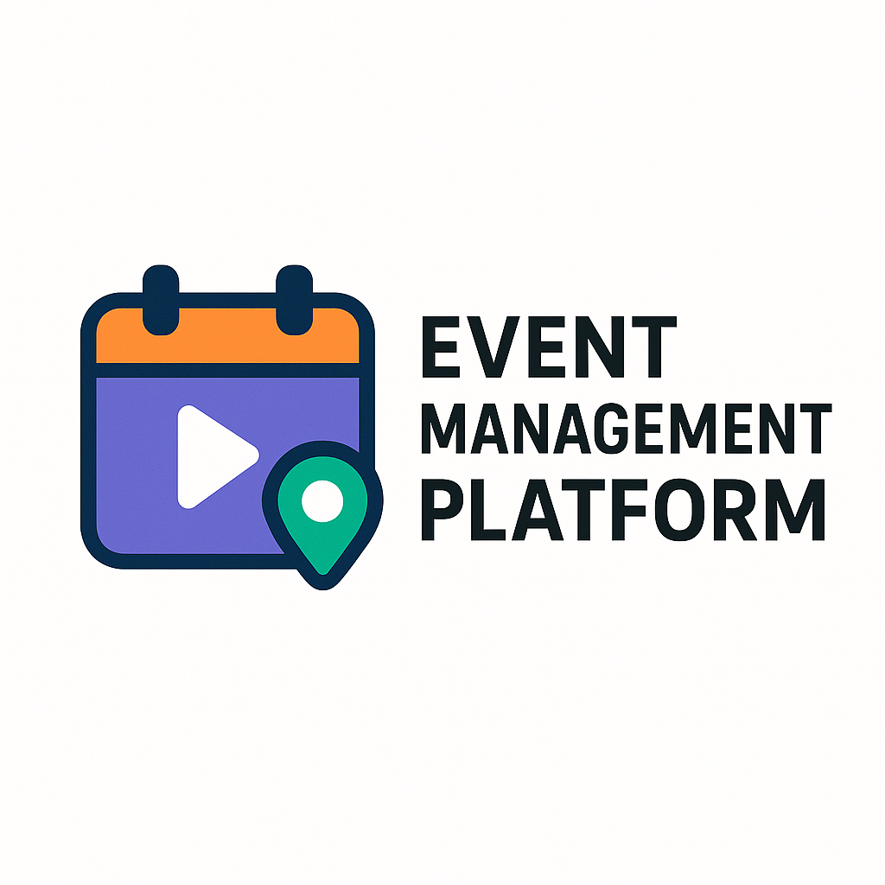

  

<h1 align="center">Revamped Event Creation and Management Platform</h1>

> A modern, intuitive platform to create, manage, and engage with events.

## 🚀 Features

- **Interactive Event Creation Wizard**  
  Step-by-step event builder with media uploads, maps integration, and smart date/time pickers.

- **Chronological Event Timeline**  
  View past and upcoming events with filters, search, and event highlights.

- **User Engagement Tools**  
  Custom invitations, event discussion forums, and social sharing options.

- **Seamless UX & Onboarding**  
  Clean interface, guided tour for new users, and detailed user event history.

- **(Optional) AI Event Recommendations**  
  Personalized event suggestions based on user interests and history.

## 🛠️ Tech Stack

- **Frontend:** HTML, CSS, JavaScript, Google Maps API
- **Backend:** Node.js, Express.js
- **Database:** MongoDB

## 📦 Setup

1. Clone the repo  
   `git clone https://github.com/your-username/event-platform.git`

2. Install dependencies  
   `npm install`

3. Run the app  
   `npm start`

## 📄 License

MIT License — free for personal & commercial use.

---
